# Manual del cliente — Comprar en Construir desde el celular

Esta guía explica, paso a paso, cómo comprar en la tienda en línea de Construir desde un
teléfono. Está pensada para alguien que entra por primera vez.

**Dirección de la tienda:** https://constru-ir.com

---

## Índice

1. [La pantalla de inicio](#1-la-pantalla-de-inicio)
2. [Buscar lo que necesita](#2-buscar-lo-que-necesita)
3. [Ver el detalle de un producto](#3-ver-el-detalle-de-un-producto)
4. [Agregar al carrito](#4-agregar-al-carrito)
5. [Revisar el carrito](#5-revisar-el-carrito)
6. [Pagar — Paso 1: su identificación](#6-pagar--paso-1-su-identificación)
7. [Pagar — Paso 2: sus datos](#7-pagar--paso-2-sus-datos)
8. [Pagar — Paso 3: cómo recibe el pedido](#8-pagar--paso-3-cómo-recibe-el-pedido)
9. [Pagar — Paso 4: la forma de pago](#9-pagar--paso-4-la-forma-de-pago)
10. [Adjuntar el comprobante y confirmar](#10-adjuntar-el-comprobante-y-confirmar)
11. [Seguir su pedido](#11-seguir-su-pedido)
12. [Crear una cuenta (opcional)](#12-crear-una-cuenta-opcional)
13. [Si olvidó su contraseña](#13-si-olvidó-su-contraseña)
14. [Preguntas frecuentes](#14-preguntas-frecuentes)

---

## 1. La pantalla de inicio

Al entrar a **constru-ir.com** verá la pantalla principal, con los productos destacados y
las categorías.

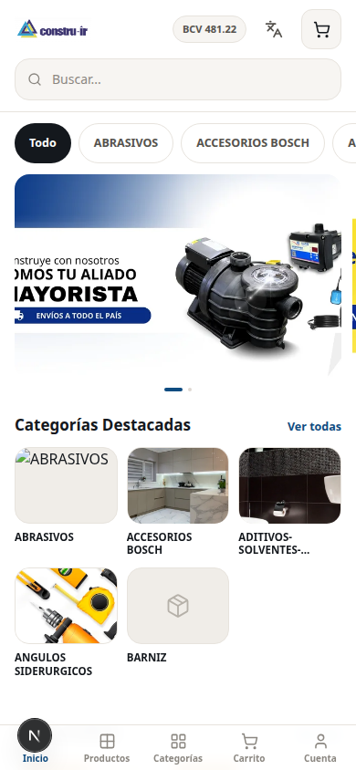

**No hace falta registrarse para comprar.** Puede hacer todo el proceso como invitado. Crear
una cuenta es opcional y sirve, sobre todo, para ver su historial de pedidos más adelante.

---

## 2. Buscar lo que necesita

Toque **Productos** o use la lupa de búsqueda en la parte de arriba.

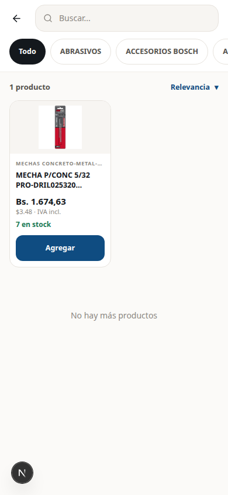

En esta pantalla puede:

- **Escribir en la barra de búsqueda** lo que necesita (por ejemplo: "mecha", "pintura", "cerradura").
- **Filtrar por categoría** con los botones de arriba (Abrasivos, Pintura, Angulos Siderúrgicos, etc.).
- **Ordenar** los resultados con el botón de la derecha: por relevancia, menor precio, mayor
  precio o nombre de la A a la Z.

### Lo que le dice cada producto

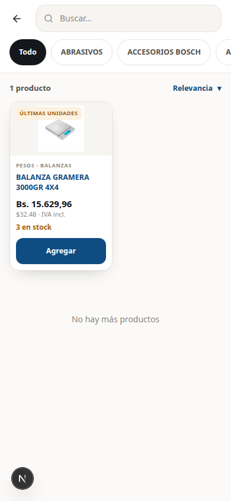

Cada tarjeta muestra:

| Dato | Qué significa |
|------|---------------|
| **Bs. 15.629,96** | El precio en bolívares, que es lo que va a pagar |
| **$32.48 · IVA incl.** | El equivalente en dólares. **El IVA ya está incluido** en ambos precios |
| **3 en stock** | Cuántas unidades hay disponibles |
| **ÚLTIMAS UNIDADES** | Aviso de que quedan pocas |

> **Sobre los precios.** Los precios en bolívares se calculan con la tasa oficial del BCV
> del día. Por eso pueden cambiar de un día para otro aunque el precio en dólares sea el mismo.

---

## 3. Ver el detalle de un producto

Toque el nombre o la foto de un producto para ver toda su información.

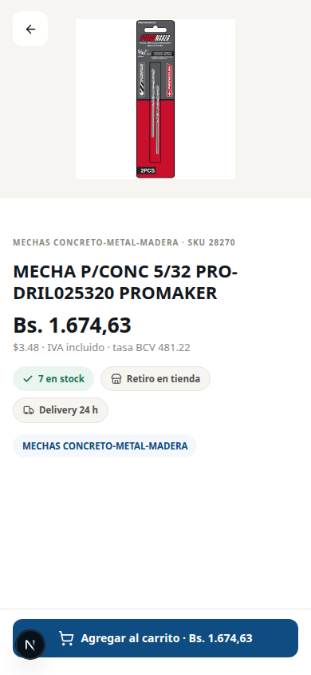

Aquí encuentra la descripción completa, las fotos disponibles y el desglose del precio.

---

## 4. Agregar al carrito

Toque el botón azul **Agregar**. El botón se convierte en un contador donde puede subir o
bajar la cantidad.

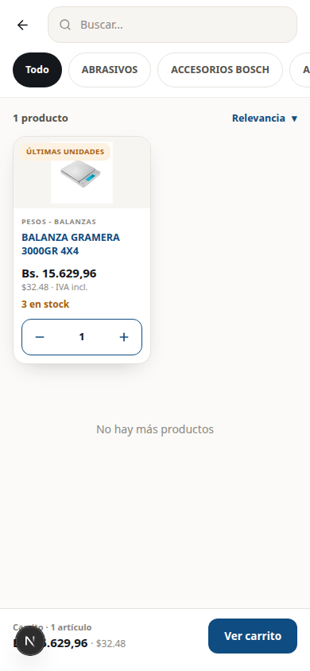

Puede seguir navegando y agregando más productos. El carrito se guarda solo, aunque cierre
el navegador.

---

## 5. Revisar el carrito

Toque el ícono del carrito para ver todo lo que lleva.

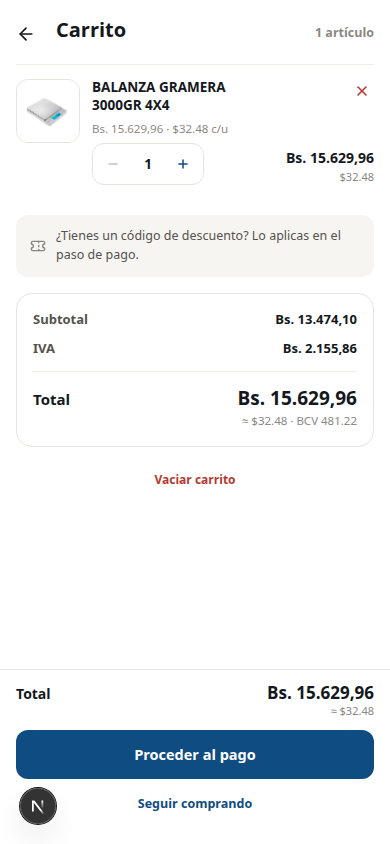

Aquí se ve el desglose completo:

| Línea | Qué es |
|-------|--------|
| **Subtotal** | El valor de la mercancía sin el impuesto |
| **IVA** | El impuesto (16%) |
| **Total** | Lo que va a pagar |
| **≈ $10.44 · BCV 481,22** | El equivalente en dólares y la tasa usada para el cálculo |

En esta pantalla puede:

- **Cambiar la cantidad** con los botones **−** y **+**.
- **Quitar un producto** con la **✕** roja.
- **Vaciar el carrito** completo.
- **Seguir comprando** para volver al catálogo.

Cuando esté listo, toque **Proceder al pago**.

> **Nota sobre los cupones.** Si tiene un código de descuento, no lo aplique aquí:
> lo va a introducir en el paso de pago.

---

## 6. Pagar — Paso 1: su identificación

El pago se hace en tres pasos. El primero es su cédula o RIF.

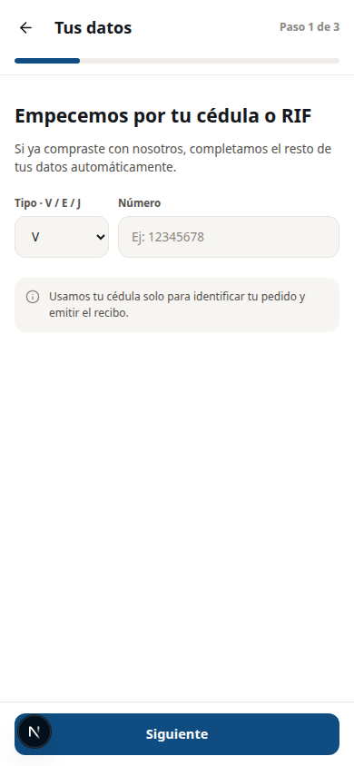

1. Elija el tipo en la lista: **V** (venezolano), **E** (extranjero), **J** (jurídico —
   empresas), **G** o **P**.
2. Escriba el número **sin puntos ni guiones**. Por ejemplo: `19555444`.

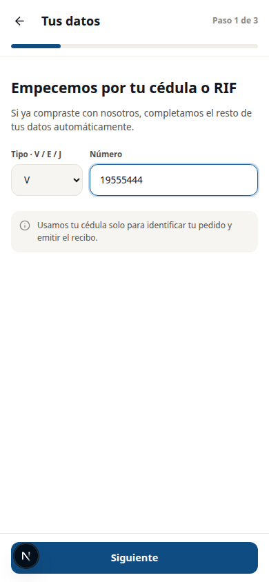

> **¿Por qué le piden la cédula primero?** Por dos razones. La primera es que se necesita
> para emitir el recibo. La segunda es que, **si usted ya compró antes**, el sistema
> completa el resto de sus datos automáticamente y se ahorra escribirlos de nuevo.

Toque **Siguiente**.

---

## 7. Pagar — Paso 2: sus datos

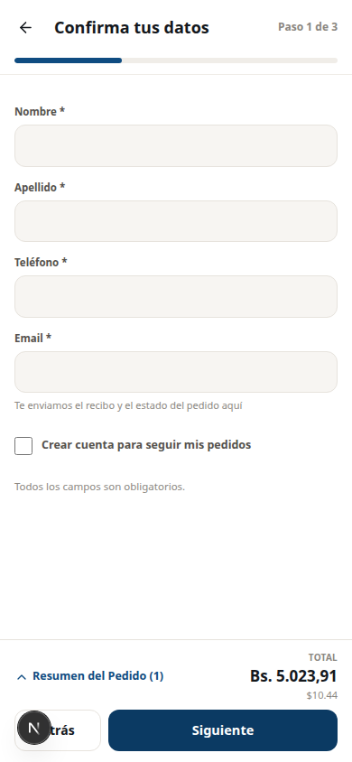

Llene los cuatro campos. **Todos son obligatorios**:

- **Nombre**
- **Apellido**
- **Teléfono** — es por donde le van a escribir para coordinar la entrega
- **Email** — es donde le llega el recibo y los avisos del pedido

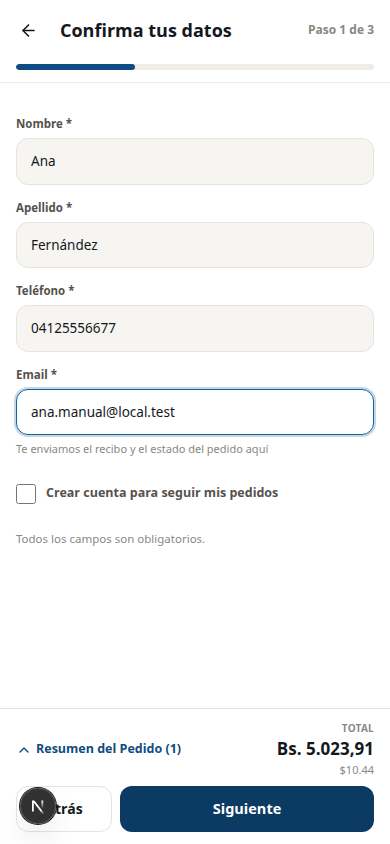

Si quiere, marque **"Crear cuenta para seguir mis pedidos"**. Es opcional: le crea una
cuenta con esos mismos datos para que después pueda entrar y ver su historial.

Toque **Siguiente**.

---

## 8. Pagar — Paso 3: cómo recibe el pedido

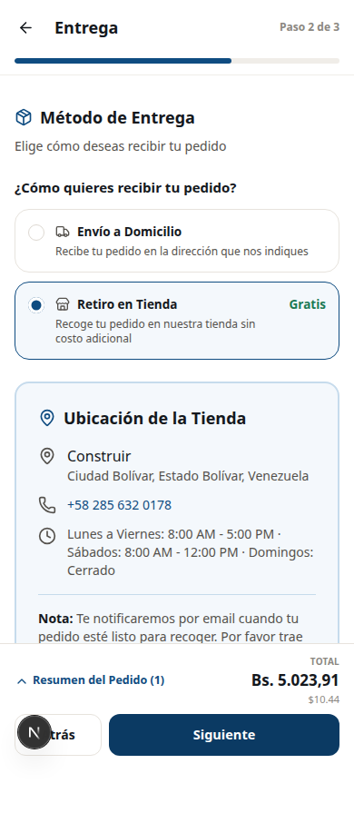

Elija una de las dos opciones:

### Envío a domicilio
Le piden la dirección donde quiere recibir el pedido. Un vendedor le escribe por WhatsApp
para coordinar el envío y su costo.

### Retiro en tienda — **Gratis**
Usted pasa buscando el pedido por la tienda. Al elegir esta opción se muestran la dirección,
el teléfono y el horario.

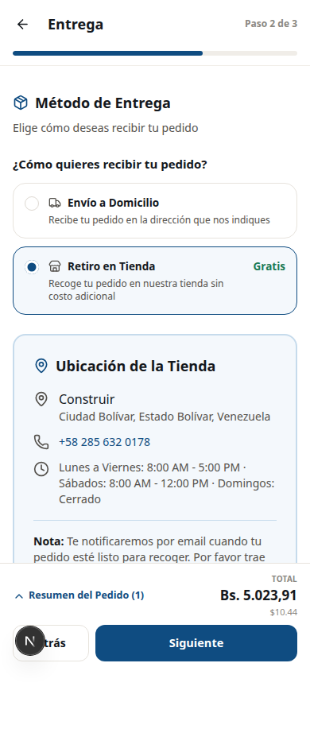

Toque **Siguiente**.

---

## 9. Pagar — Paso 4: la forma de pago

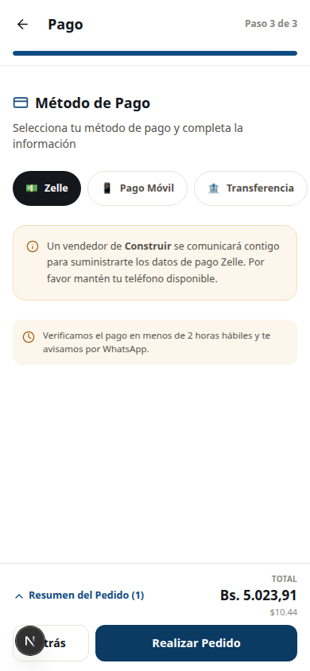

Hay tres formas de pagar:

| Forma | Cómo funciona |
|-------|---------------|
| 💵 **Zelle** | Un vendedor lo contacta para darle los datos. Mantenga el teléfono disponible. |
| 📱 **Pago Móvil** | Le muestran los datos en pantalla y usted paga desde su banco. |
| 🏦 **Transferencia** | Le muestran la cuenta bancaria y usted transfiere. |

### Si elige Pago Móvil o Transferencia

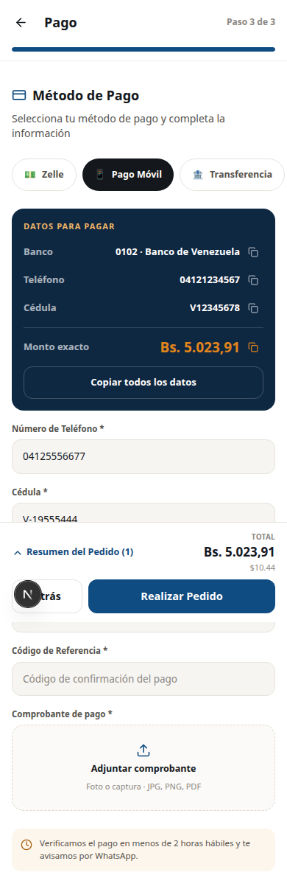

En el recuadro oscuro aparecen **los datos exactos para pagar**:

- El banco y su código
- El teléfono o el número de cuenta
- La cédula o el RIF del beneficiario
- **El monto exacto** que debe transferir

> 💡 **Consejo:** toque **"Copiar todos los datos"** para copiarlos de un golpe y pegarlos
> en la aplicación de su banco. Cada dato también tiene su propio botón de copiar.

**Haga el pago desde su banco** y vuelva a esta pantalla. Luego llene:

- **Número de Teléfono** y **Cédula** — vienen puestos con sus datos de contacto.
  Cámbielos si pagó desde otro titular.
- **Banco Emisor** — elija de la lista el banco **desde donde** hizo el pago.
- **Código de Referencia** — el número de referencia que le dio su banco.

---

## 10. Adjuntar el comprobante y confirmar

**Este paso es obligatorio.** Sin el comprobante no se puede confirmar el pedido.

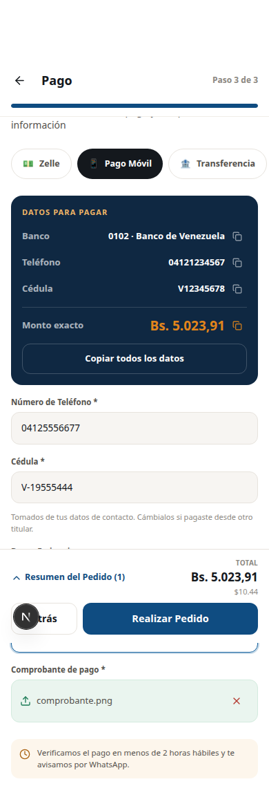

Toque **Adjuntar comprobante** y suba la foto o la captura de pantalla del pago.
Se aceptan archivos **JPG, PNG o PDF**.

Cuando todo esté listo, toque **Realizar Pedido**.

### ¡Listo!

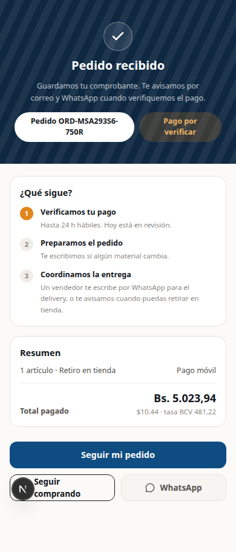

Verá la pantalla de confirmación con:

- **Su número de pedido** (por ejemplo `ORD-MSA293S6-750R`). **Anótelo**: le sirve para
  consultar el estado después.
- El estado: **Pago por verificar**.
- Los tres pasos que siguen:
  1. **Verificamos su pago** — hasta 24 horas hábiles.
  2. **Preparamos el pedido** — le escriben si algún material cambia.
  3. **Coordinamos la entrega** — un vendedor le escribe por WhatsApp.

También le llega un correo con el resumen del pedido.

---

## 11. Seguir su pedido

Puede consultar el estado en cualquier momento, **sin necesidad de tener cuenta**.

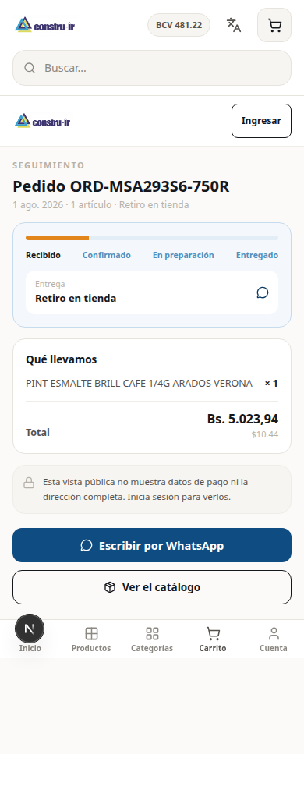

Entre a **constru-ir.com/seguimiento/SU-NÚMERO-DE-PEDIDO**, o use la opción de seguimiento
del menú y escriba su número.

### Los estados de un pedido

| Estado | Qué significa |
|--------|---------------|
| **En espera** | El pedido entró y su pago está por verificar. |
| **Pendiente** | El pago fue verificado y el pedido está en preparación. |
| **Completada** | El pedido fue facturado y está listo. |
| **Cancelada** | El pedido fue anulado. |

---

## 12. Crear una cuenta (opcional)

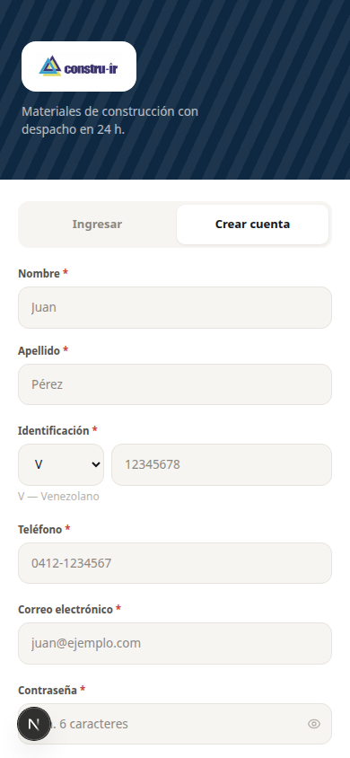

Tener cuenta le sirve para ver su historial de pedidos y no volver a escribir sus datos.

1. Entre a **Crear cuenta**.
2. Llene nombre, apellido, correo y una contraseña de **al menos 6 caracteres**.
3. **Revise su correo**: le llega un mensaje para verificar la dirección.
4. Toque el enlace de ese correo.
5. Ya puede entrar.

> ⚠️ **Importante:** hasta que no toque el enlace del correo, **no va a poder iniciar
> sesión**. Si no le llegó, revise la carpeta de correo no deseado (spam).

Para entrar después:

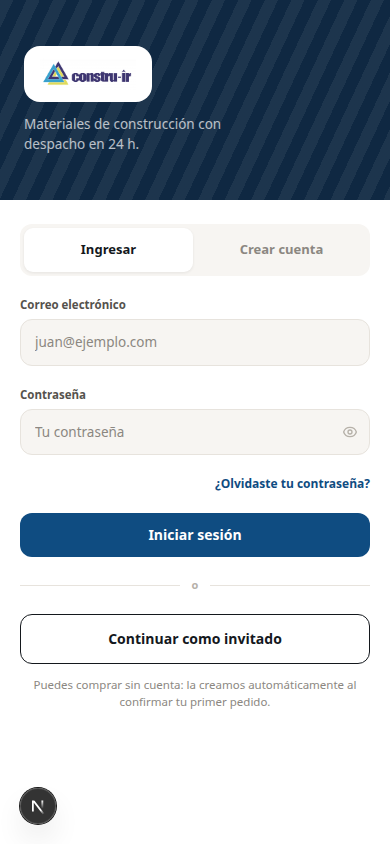

---

## 13. Si olvidó su contraseña

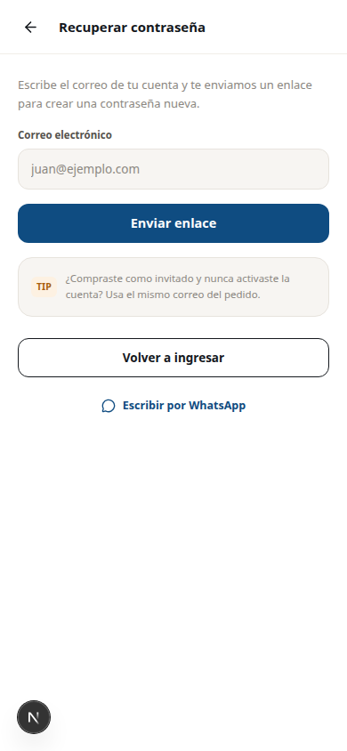

1. En la pantalla de inicio de sesión, toque **¿Olvidó su contraseña?**
2. Escriba el correo con el que se registró.
3. Le llega un mensaje con un enlace.
4. Toque el enlace y escriba su contraseña nueva.

> El enlace tiene vencimiento. Si se le pasó el tiempo, simplemente pida uno nuevo.

---

## 14. Preguntas frecuentes

**¿Tengo que registrarme para comprar?**
No. Puede comprar como invitado. La cuenta es opcional.

**¿Los precios incluyen IVA?**
Sí. Tanto el precio en bolívares como el de referencia en dólares ya incluyen el IVA. En el
carrito puede ver el desglose de cuánto es mercancía y cuánto es impuesto.

**¿Por qué el precio en bolívares cambió de un día para otro?**
Porque se calcula con la tasa oficial del BCV, que se actualiza a diario. El precio en
dólares es el mismo; lo que cambia es la conversión.

**¿Puedo pagar con tarjeta?**
Por ahora no. Las formas de pago son Zelle, Pago Móvil y Transferencia bancaria.

**¿Cuánto tardan en verificar mi pago?**
Hasta 24 horas hábiles. En la práctica suele ser menos de 2 horas en horario de oficina.

**Me equivoqué en el comprobante, ¿qué hago?**
Escriba por WhatsApp usando el botón de contacto del sitio, con su número de pedido a la mano.

**¿Puedo cancelar un pedido?**
Sí, pero se gestiona por WhatsApp. Comuníquese con la tienda con su número de pedido.

**¿Cuánto cuesta el envío?**
El retiro en tienda es gratis. Para el envío a domicilio, un vendedor le indica el costo por
WhatsApp según su dirección.

**¿Dónde queda la tienda?**
Ciudad Bolívar, Estado Bolívar. El teléfono es +58 285 632 0178 y el horario es de lunes a
viernes de 8:00 AM a 5:00 PM, y sábados de 8:00 AM a 12:00 PM.

---

*Las imágenes de este manual se tomaron de un entorno de pruebas. Algunos productos aparecen
con un recuadro gris en lugar de la foto porque ese entorno no tiene todas las imágenes
descargadas; en el sitio real las fotos se ven completas.*
