# Manual del administrador — Panel de Construir

Guía del panel de administración de Construir. Está pensada para usarse desde una
computadora de escritorio o laptop.

**Dirección del panel:** https://constru-ir.com/admin/login

---

## Índice

1. [Entrar al panel](#1-entrar-al-panel)
2. [El Dashboard](#2-el-dashboard)
3. [Órdenes — el día a día](#3-órdenes--el-día-a-día)
4. [Ver y atender una orden](#4-ver-y-atender-una-orden)
5. [Productos](#5-productos)
6. [Crear o editar un producto](#6-crear-o-editar-un-producto)
7. [Categorías](#7-categorías)
8. [Cupones de descuento](#8-cupones-de-descuento)
9. [Banners](#9-banners)
10. [Clientes](#10-clientes)
11. [Usuarios del panel e invitaciones](#11-usuarios-del-panel-e-invitaciones)
12. [Claves API — la conexión con el ERP](#12-claves-api--la-conexión-con-el-erp)
13. [Logs de API](#13-logs-de-api)
14. [Auditoría](#14-auditoría)
15. [Recomendaciones de seguridad](#15-recomendaciones-de-seguridad)

---

## 1. Entrar al panel

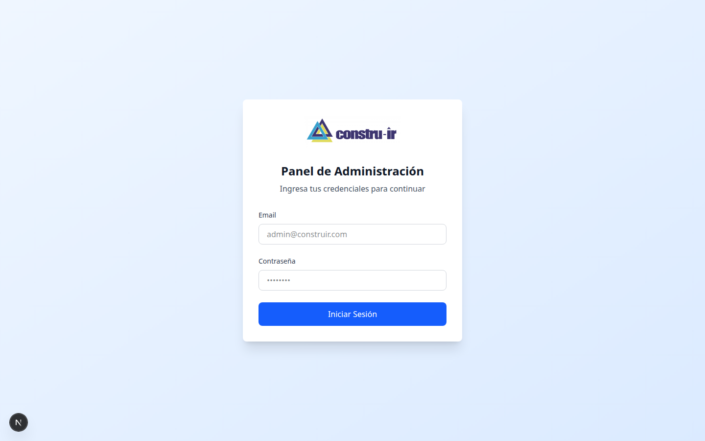

Escriba su correo y su contraseña. El panel es **solo para personal autorizado**.

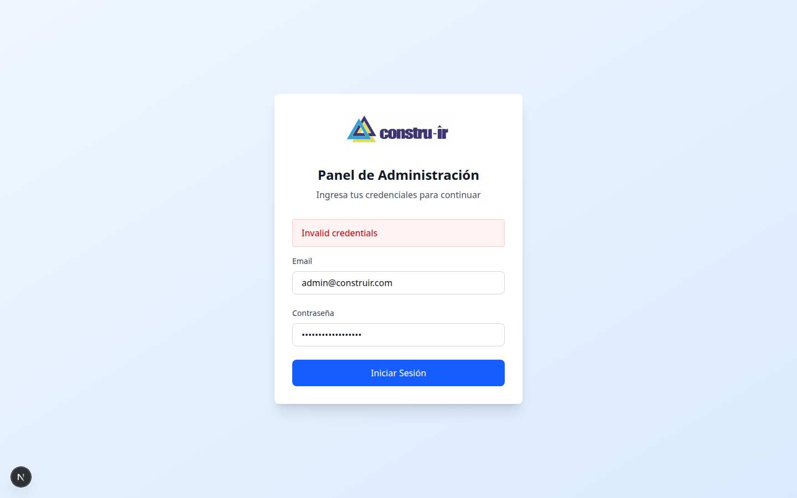

Si los datos están mal, el panel no lo deja entrar y se queda en la misma pantalla.
Esto fue verificado en las pruebas: no hay forma de entrar sin credenciales válidas.

**Arriba a la derecha** verá siempre su nombre, su rol (Admin) y el botón **Cerrar Sesión**.

> 🔐 La sesión vence a las 24 horas. Después de ese tiempo tendrá que volver a entrar.

---

## 2. El Dashboard

Es la primera pantalla al entrar. Da el panorama general del negocio.

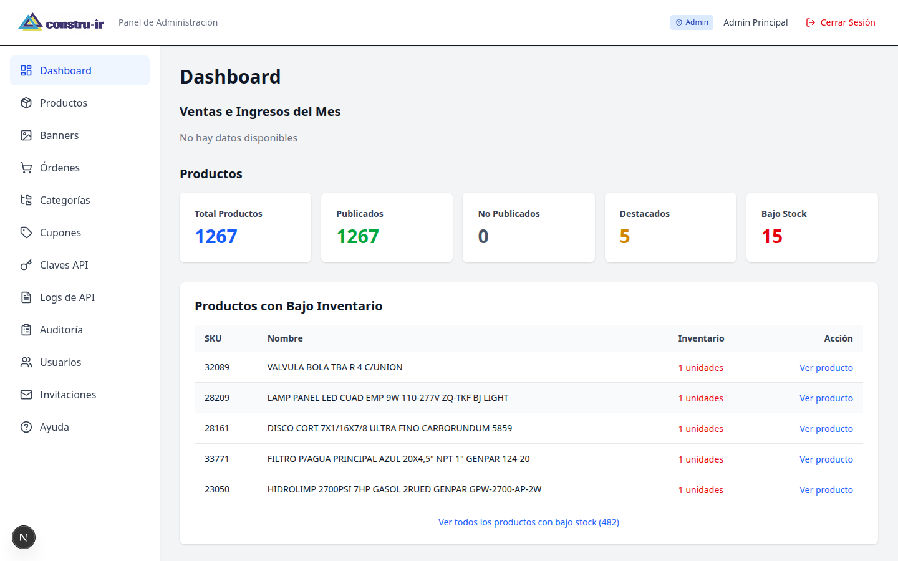

### Lo que muestra

**Ventas e Ingresos del Mes** — el resumen de ventas del mes en curso.

**Tarjetas de productos:**

| Tarjeta | Qué le dice |
|---------|-------------|
| **Total Productos** | Cuántos productos hay cargados en total |
| **Publicados** | Cuántos se ven en la tienda |
| **No Publicados** | Cuántos están ocultos para el público |
| **Destacados** | Cuántos aparecen resaltados en la página de inicio |
| **Bajo Stock** | Cuántos están por agotarse — **esta es la que hay que vigilar** |

**Productos con Bajo Inventario** — la lista de lo que está por acabarse, con su código
(SKU), el nombre y cuántas unidades quedan. El enlace de abajo le muestra la lista completa.

> 💡 **Úselo todos los días.** Es la forma más rápida de saber qué hay que reponer antes
> de que un cliente compre algo que no tiene.

---

## 3. Órdenes — el día a día

Es la pantalla que más va a usar.

### La barra de arriba

Muestra un resumen: cuántas órdenes hay, cuántas esperan revisión de pago y **la tasa BCV
del día** que se está usando para los cálculos.

### Las cuatro tarjetas

| Tarjeta | Qué significa |
|---------|---------------|
| **Órdenes totales** | El total, con cuántas van este mes y cuántas hoy |
| **Pagos por revisar** | **La más importante.** Cuántos clientes ya pagaron y esperan que usted verifique. También le dice cuánto lleva esperando la más antigua. |
| **Ingresos verificados** | Cuánto dinero se ha confirmado |
| **Ticket promedio** | El monto promedio por orden cobrada |

### Buscar y filtrar

- **La barra de búsqueda** encuentra órdenes por número, nombre del cliente, cédula/RIF o
  referencia de pago.
- **Estado del pago** y **rango de fechas** filtran el listado.
- **Las pestañas** separan por estado: Todas, Pago en revisión, En espera, Pendientes,
  Completadas, Canceladas.

### El listado

Cada fila muestra el número de orden, la fecha, el cliente con su cédula, el estado, el
estado del pago y la forma de entrega.

**Exportar CSV** (arriba a la derecha) descarga el listado para abrirlo en Excel.

### Los estados de una orden

| Estado | Qué significa | Quién lo cambia |
|--------|---------------|-----------------|
| **En Espera** | La orden entró y espera que se verifique el pago | — |
| **Pendiente** | El ERP la tomó y registró su orden de compra | El ERP (OrbisNet) |
| **Completada** | El ERP la facturó | El ERP (OrbisNet) |
| **Cancelada** | La orden fue anulada | El ERP o usted |

---

## 4. Ver y atender una orden

Haga clic en cualquier fila para abrir el detalle.

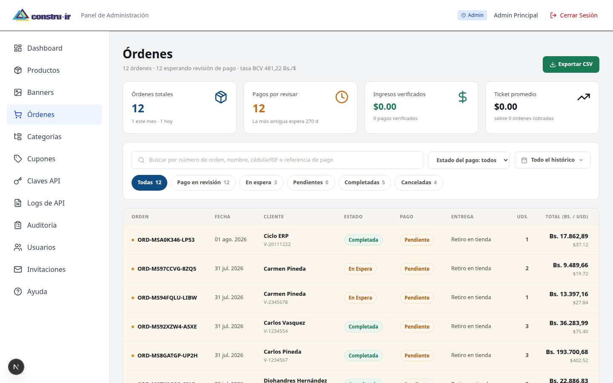

En el detalle encuentra:

- Los datos del cliente (nombre, cédula, teléfono, correo).
- Los productos pedidos, con cantidades y precios.
- El desglose de montos: mercancía, impuesto y total, en bolívares y en dólares.
- La tasa de cambio usada.
- La forma de entrega y, si es a domicilio, la dirección.
- La forma de pago y **el comprobante que subió el cliente**.

### El flujo de trabajo típico

1. **Revise "Pagos por revisar"** en el listado.
2. **Abra la orden** y mire el comprobante que subió el cliente.
3. **Compare** el monto y la referencia contra su cuenta bancaria.
4. **Marque el pago** como verificado o rechazado.
5. A partir de ahí, **el ERP toma la orden** y sigue el proceso de facturación.

> ⚠️ Si rechaza un pago, al cliente le llega un correo avisándole.

---

## 5. Productos

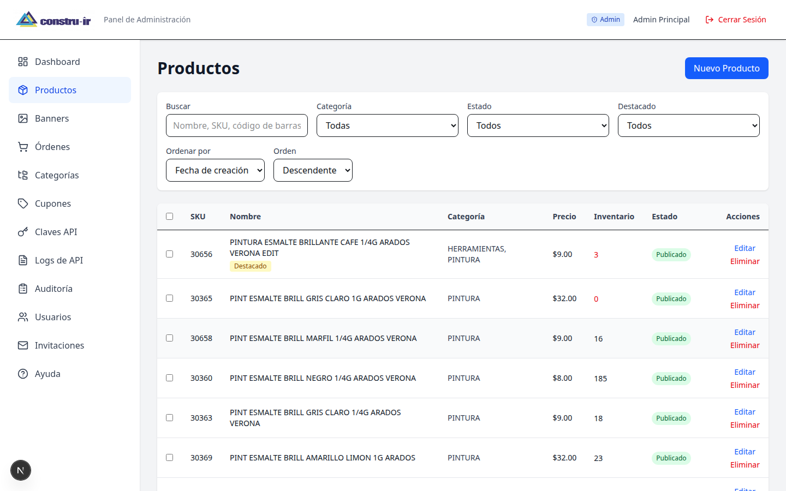

Aquí administra todo el catálogo. Puede buscar, filtrar y editar productos.

Las acciones en lote le permiten **publicar/despublicar** o **destacar** varios productos
de una sola vez.

> **Publicado vs. no publicado.** Un producto no publicado sigue existiendo en el sistema
> pero **no aparece en la tienda**. Úselo para productos que va a cargar pero todavía no
> quiere vender.

---

## 6. Crear o editar un producto

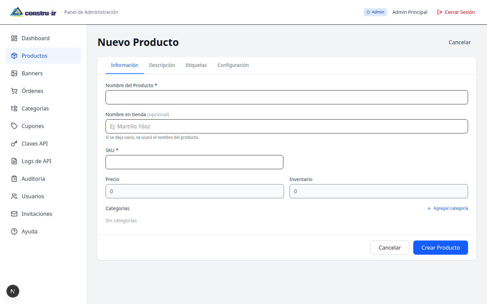

Los campos principales:

| Campo | Para qué sirve |
|-------|----------------|
| **Nombre** | El nombre que viene del sistema |
| **Nombre personalizado** | Un nombre más claro para mostrar en la tienda |
| **SKU** | El código del producto. **Es el que usa el ERP para identificarlo** |
| **Precio** | **El precio base, SIN IVA, en dólares** |
| **Inventario** | Cuántas unidades hay |
| **Categorías** | En qué categorías aparece |
| **Imágenes** | Las fotos del producto |
| **Publicado** | Si se ve o no en la tienda |
| **Destacado** | Si aparece resaltado en la página de inicio |

> ⚠️ **Importante sobre el precio.** Se carga **sin IVA y en dólares**. El sistema calcula
> solo el IVA (16%) y la conversión a bolívares con la tasa del BCV del día. Si carga
> `9.00`, el cliente verá `$10.44 con IVA incluido`.

---

## 7. Categorías

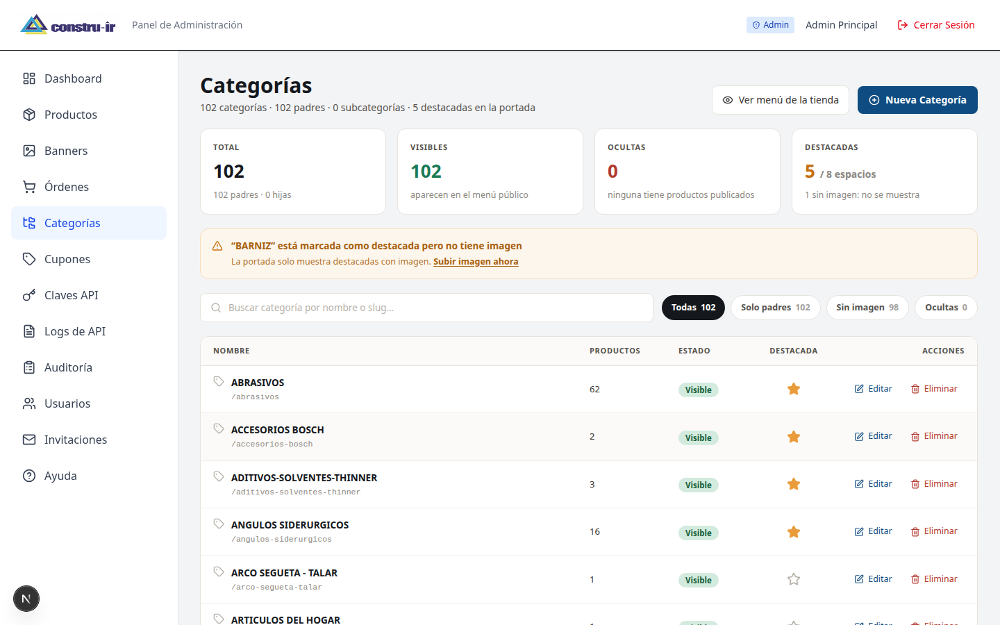

Las categorías organizan el catálogo. Pueden tener subcategorías.

Cada categoría tiene un campo **código externo** (`externalCode`) que es **el que la conecta
con el ERP**. Si el ERP maneja sus propios códigos de categoría, aquí es donde se hacen
coincidir.

También puede marcar categorías como **destacadas** (salen en la página de inicio) o
**visibles/ocultas**.

---

## 8. Cupones de descuento

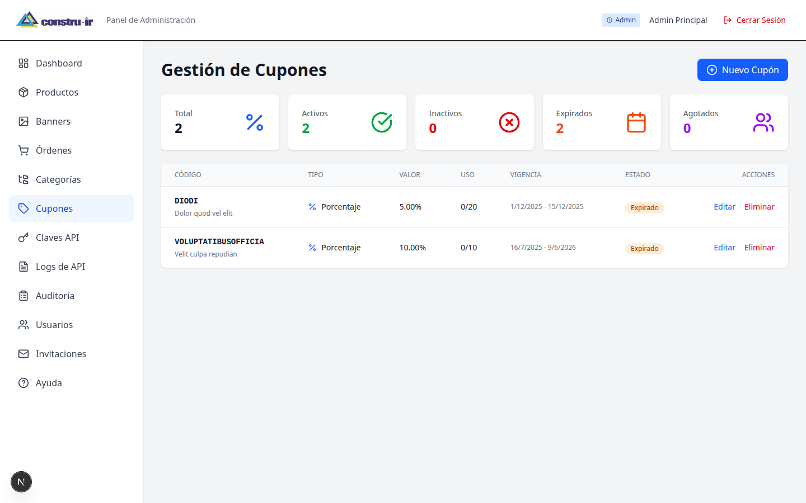

Aquí crea y administra los códigos de descuento. Para cada cupón puede definir el código
que escribe el cliente, el tipo de descuento (monto fijo o porcentaje), su valor, la fecha
de vencimiento y el límite de usos.

---

## 9. Banners

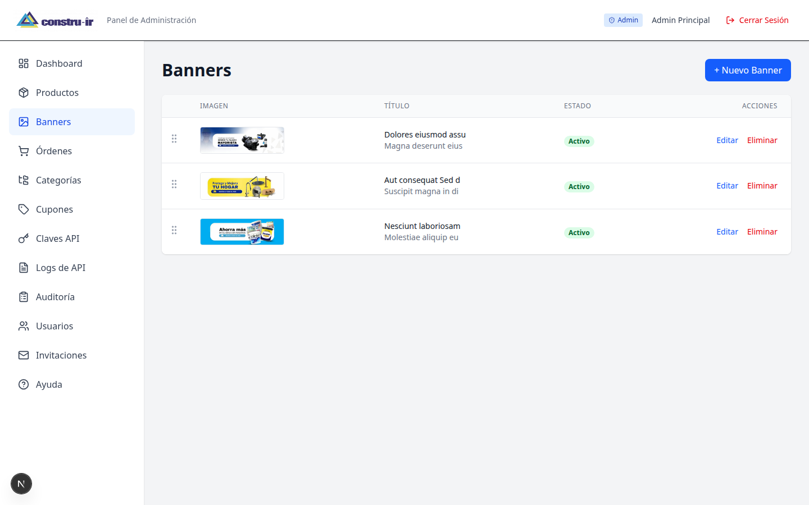

Los banners son las imágenes promocionales de la página de inicio. Puede crearlos,
activarlos, desactivarlos y ordenarlos.

---

## 10. Clientes

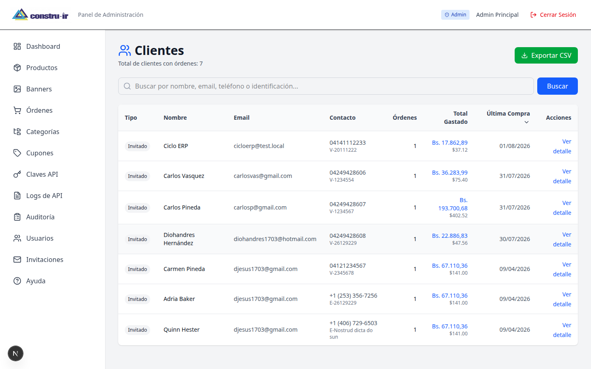

El listado de clientes registrados y de quienes compraron como invitados. Puede ver el
detalle de cada uno y su historial de compras, y exportar el listado a CSV.

> 🔐 Esta pantalla contiene datos personales. Solo el personal autorizado debe verla.

---

## 11. Usuarios del panel e invitaciones

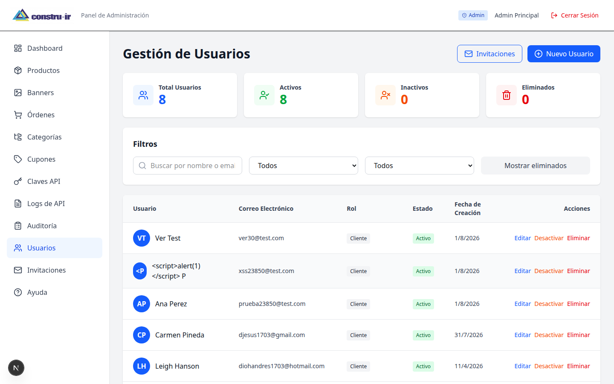

Aquí administra **quién puede entrar al panel**. Hay dos roles:

| Rol | Qué puede hacer |
|-----|-----------------|
| **ADMIN** | Todo |
| **ORDER_ADMIN** | Trabajar con órdenes y clientes, sin tocar la configuración |

### Invitar a alguien

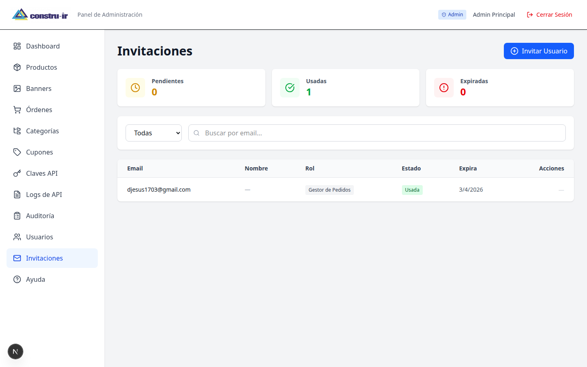

En vez de crear la cuenta y mandar la contraseña por mensaje, use **invitaciones**: el
sistema le manda un correo a la persona para que ella misma ponga su contraseña. Es más
seguro.

En esta pantalla ve las invitaciones enviadas, cuáles siguen pendientes, y puede cancelarlas.

---

## 12. Claves API — la conexión con el ERP

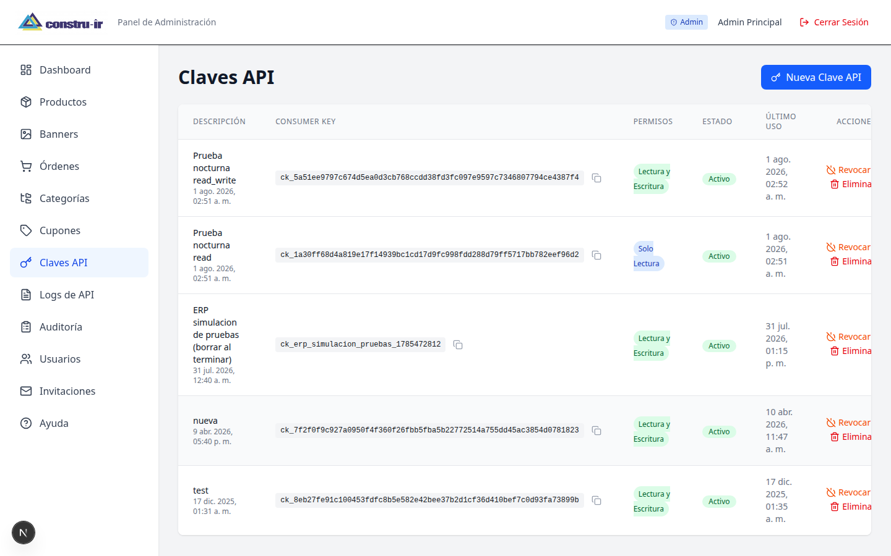

Esta pantalla es la que conecta la tienda con **OrbisNet (el ERP)**.

Cada clave tiene dos partes:

- **Consumer Key** — el identificador. Se ve en la pantalla y se puede copiar.
- **Consumer Secret** — la clave secreta. **Solo se muestra UNA VEZ**, al momento de crearla.

### Los permisos

| Permiso | Qué puede hacer el sistema externo |
|---------|-----------------------------------|
| **Solo Lectura** | Consultar órdenes y productos, sin modificar nada |
| **Solo Escritura** | Modificar, sin consultar |
| **Lectura y Escritura** | Ambas cosas. **Es la que necesita el ERP** |

### Crear una clave nueva

1. Toque **Nueva Clave API**.
2. Escriba una descripción clara (por ejemplo: "OrbisNet producción").
3. Elija el permiso.
4. **Copie y guarde el Consumer Secret inmediatamente.** No se vuelve a mostrar. Si lo
   pierde, hay que crear una clave nueva.

### Revocar vs. Eliminar

- **Revocar** desactiva la clave pero la deja en el listado, con su historial.
- **Eliminar** la borra por completo.

Si sospecha que una clave se filtró, **revóquela de inmediato** y cree otra.

> 💡 La columna **Último uso** le dice cuándo se usó cada clave por última vez. Si una clave
> lleva meses sin usarse, probablemente ya no hace falta y conviene eliminarla.

---

## 13. Logs de API

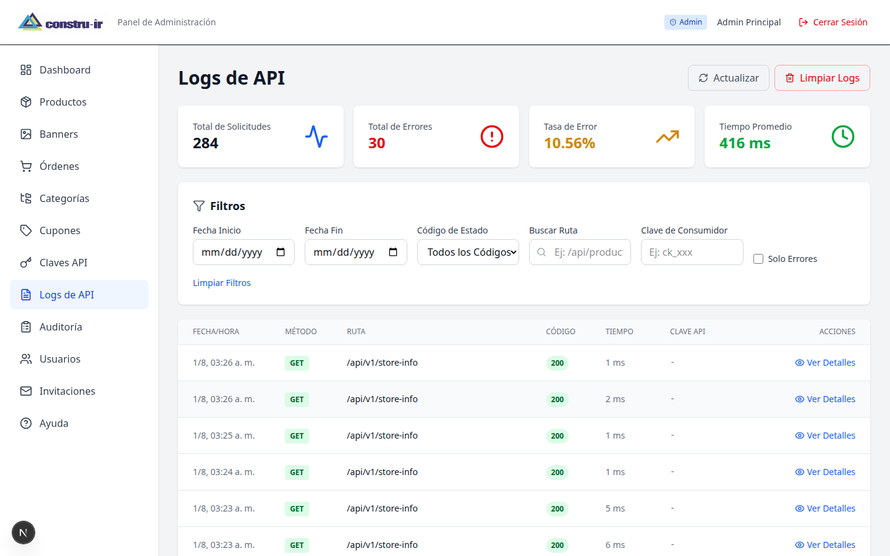

Aquí queda registrada **cada llamada que hace el ERP** al sistema. Es la herramienta para
resolver problemas de integración.

De cada llamada puede ver qué se pidió, qué se respondió, cuánto tardó y qué clave se usó.

> 💡 **Cuando el ERP diga "la tienda no me responde"**, esta es la primera pantalla que
> debe abrir. Le dice si la llamada llegó, y qué se respondió exactamente.

---

## 14. Auditoría

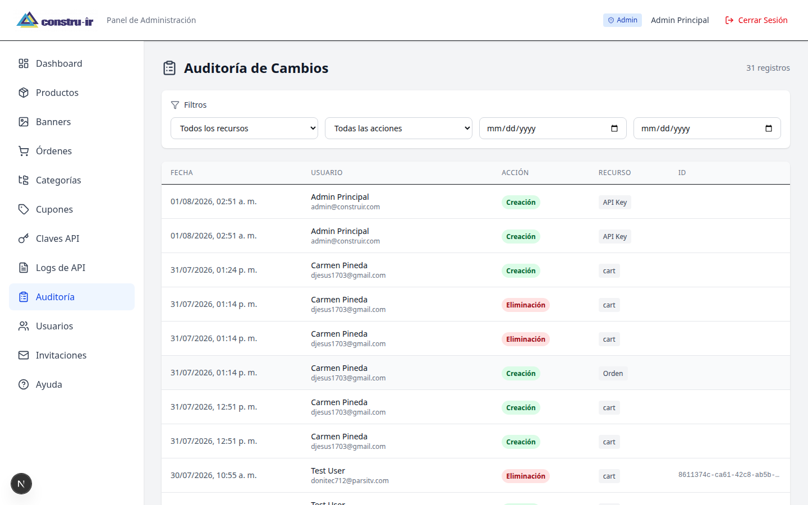

El registro de **quién hizo qué dentro del panel**: cambios de precio, productos borrados,
usuarios creados, órdenes modificadas.

Sirve para dos cosas: entender qué pasó cuando algo cambió sin explicación, y tener
trazabilidad de las acciones del personal.

---

## 15. Recomendaciones de seguridad

1. **Cada persona con su propio usuario.** No compartan una sola cuenta: el registro de
   auditoría pierde todo su valor si todos entran como "admin".

2. **Use invitaciones**, no contraseñas enviadas por mensaje.

3. **Dé el rol mínimo necesario.** Quien solo atiende pedidos no necesita ser ADMIN.

4. **Guarde el Consumer Secret en un lugar seguro** apenas lo cree. En un gestor de
   contraseñas, no en un chat ni en un papel.

5. **Revise las Claves API cada cierto tiempo.** Elimine las que ya no se usan (mire la
   columna "Último uso").

6. **Cierre sesión** cuando termine, sobre todo en computadoras compartidas.

7. **Revise el registro de auditoría** de vez en cuando, aunque no haya pasado nada raro.

---

## Anexo — Ayuda dentro del panel

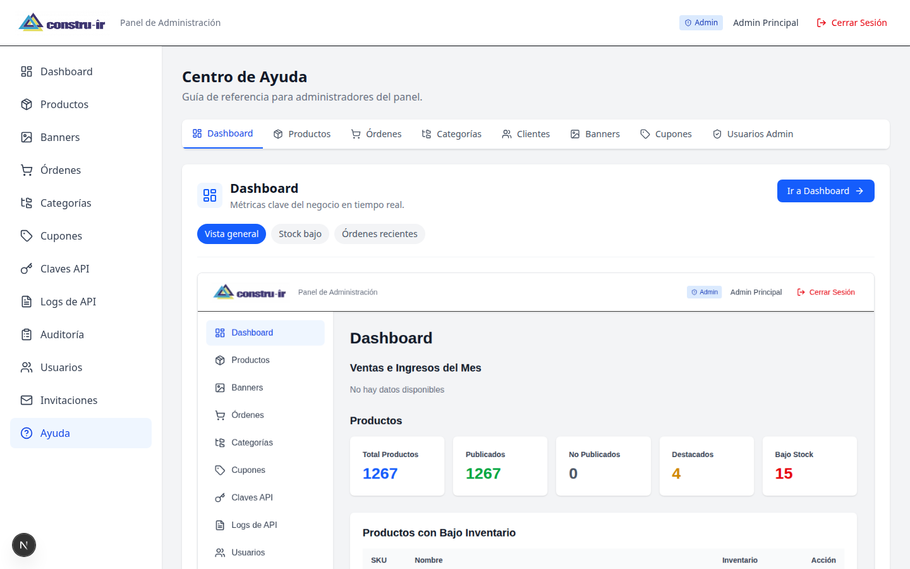

El panel tiene su propia sección de **Ayuda** con documentación de las funciones.

---

*Las capturas de este manual se tomaron de un entorno de pruebas con el catálogo real. Los
datos de órdenes y clientes que aparecen son de prueba, no corresponden a operaciones reales.*
